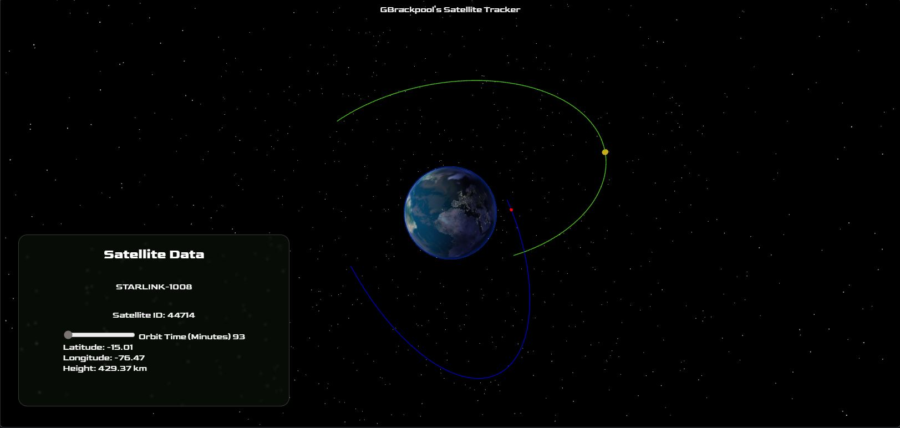
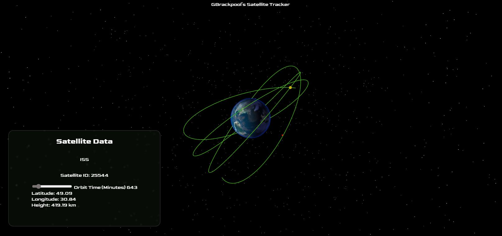

# GBrackpool Satellite Tracker
An interactive 3D satellite visualisation system built with Three.js and satellite.js that propagates real TLE (Two-Line Element) orbital data from Celestrak using the SGP4 algorithm to display current satellite positions and predicted orbital trajectories.

## Features

- Satellite Propagation using SGP4
- Interactive 3D earth rendered with Three.js
- Orbit prediction visualisation (Orbit lines)
- Able to track multiple satellites simultaneously
- Satellite selection via raycasting
- Dynamic satellite information panel when satellite is selected
- Adjustable orbit prediction
- Various VFX such as starfield background and earth textures

## Tech Stack

- Javascript
- Three.js
- Satellite.js
- Vite
- HTML/CSS

Satellite.js is used for the SGP4 orbital propagation calculations from TLE data.

## Architecture

The project was originally all running via one main.js file. After the project continued to grow and I wanted to implement multiple satellites I recognised I needed to refactor the code and implement a good architecture to support this. The project was then refactored into modular systems to seperate elements such as rendering, UI, the simulation logic and the running of the application.

The modular systems are:
- `Earth`: Rendering of the earth sphere and atmospheric visuals.
- `Environment`: Scene, renderer, visual effects, camera and orbit/camera controls.
- `SatelliteTracker`: Satellite Propagation and Orbit Calculations.
- `UIManager`: Frontend UI, DOM updates.
- `SatelliteManager`: Manages active satellites.
- `main`: main control/orchestration, raycasting and render loop.

## Orbit Prediction

Orbit paths are calculated and generated by propagating ("predicting") real TLE orbital data forward in time using the SGP4 algorithm via satellite.js.

Future satellite positions are sampled across a user-adjustable prediction window (via a slider) and converted from Earth-Centered Inertial (ECI) coordinates into geodetic latitude, longitude and altitude before being transformed into 3D world-space positions for rendering.

# Future Improvements
- Implement the ability to add satellites in bulk (30+)
- Satellite categories and filtering
- Camera tracking/Follow camera mode
- Performance optimisations for more satellites
- Implementation of Sun and Shadow to determine if a satellite is either in sun or shadow for informational purposes
## Live Demo

